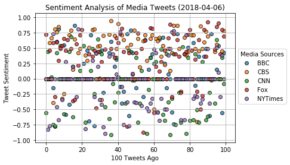
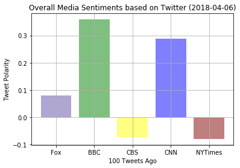

# Observable Trends and Description:

Twitter is widely used by individuals and the mass media nowadays to spread their news, thoughts, relations, and attitude toward different aspects of life.

## 1. Twitter is constanly used to send tweets; some days are more productive than the others.
Table: The mass media analyzed here uses Twitter to send tweets everyday. Most of the tweets are sent on Thursday and Friday, every hour or two. Then, on weekends, the amount of tweets falls, slowly increasing from Monday. 

## 2. All media sources included in our sentiment analysis send positive, negative, and neutral sentimental tweets. 
Plot 1: Overall, there are much more positive tweets than negative ones. Some media sources are generally more positive than the others: CBC and Fox are mostly represented in the 'positive' part of the plot. The 'negative' part shows the presence of mainly CNN and NYTimes, although with a more precise look these sources are well distributed all over the plot.  

## 3. Some of our media sources tend to be more consistent with their mood preferences, whereas the others have a more polar attitude toward the topic.
Plot 2: Fox, CBS, and NYTimes are relatively consistent with their sentiments; BBC and CNN gave more polar tweets.


```python
# NewsMood
# Create a Python script to perform a sentiment analysis of the Twitter activity
# of various news oulets, and to present your findings visually.

# Dependencies
import tweepy
import json
import pandas as pd
import numpy as np
import seaborn as sns
import matplotlib.pyplot as plt
from textblob import TextBlob
from datetime import datetime, timezone
from config import consumer_key, consumer_secret, access_token, access_token_secret
from vaderSentiment.vaderSentiment import SentimentIntensityAnalyzer
analyzer = SentimentIntensityAnalyzer()
```


```python
# Setup Tweepy API Authentication
auth = tweepy.OAuthHandler(consumer_key, consumer_secret)
auth.set_access_token(access_token, access_token_secret)
api = tweepy.API(auth, parser=tweepy.parsers.JSONParser())
```


```python
# Target Users: 
target_users = ["Fox", "BBC", "CBS", "CNN", "NYTimes"]
```


```python
#* Pull into a DataFrame the tweet's source acount, its text, its date, and its
#  compound, positive, neutral, and negative sentiment scores.
all = pd.DataFrame()
tweets_per_user = 100  # 100 tweets from each user

for user in target_users:
    n = 0
    public_tweets = api.user_timeline(user, count = tweets_per_user)
    for tweet in public_tweets[:100]:
        results = analyzer.polarity_scores(tweet["text"])
        pos = results['pos']
        neu = results['neu']
        neg = results['neg']
        comp = results['compound']
        diff = int((datetime.strptime(tweet["created_at"], '%a %b %d %H:%M:%S %z %Y')-datetime.now(timezone.utc)).total_seconds())
        all = all.append([{"positive": pos,
                           "neutral": neu,
                           "negative": neg,
                           "compound": comp,
                           "user":user,
                           "datetime":tweet["created_at"],
                           "sec ago": diff,
                           "number": n,
                           "text": tweet['text']
                          }])
        n = n + 1
    
all

```


<div>
<style>
    .dataframe thead tr:only-child th {
        text-align: right;
    }

    .dataframe thead th {
        text-align: left;
    }

    .dataframe tbody tr th {
        vertical-align: top;
    }
</style>
<table border="1" class="dataframe">
  <thead>
    <tr style="text-align: right;">
      <th></th>
      <th>compound</th>
      <th>datetime</th>
      <th>negative</th>
      <th>neutral</th>
      <th>number</th>
      <th>positive</th>
      <th>sec ago</th>
      <th>text</th>
      <th>user</th>
    </tr>
  </thead>
  <tbody>
    <tr>
      <th>0</th>
      <td>0.7177</td>
      <td>Fri Apr 06 09:47:15 +0000 2018</td>
      <td>0.000</td>
      <td>0.572</td>
      <td>0</td>
      <td>0.428</td>
      <td>-39622</td>
      <td>@pmarsceill ahh, interesting! Might apply for ...</td>
      <td>Fox</td>
    </tr>
    <tr>
      <th>0</th>
      <td>0.0000</td>
      <td>Fri Apr 06 07:48:45 +0000 2018</td>
      <td>0.000</td>
      <td>1.000</td>
      <td>1</td>
      <td>0.000</td>
      <td>-46732</td>
      <td>@johnbarton 🥂</td>
      <td>Fox</td>
    </tr>
    <tr>
      <th>0</th>
      <td>0.4576</td>
      <td>Fri Apr 06 04:35:57 +0000 2018</td>
      <td>0.000</td>
      <td>0.857</td>
      <td>2</td>
      <td>0.143</td>
      <td>-58300</td>
      <td>RT @aprilwensel: “I absolutely support women i...</td>
      <td>Fox</td>
    </tr>
    <tr>
      <th>0</th>
      <td>0.0000</td>
      <td>Fri Apr 06 04:33:31 +0000 2018</td>
      <td>0.151</td>
      <td>0.735</td>
      <td>3</td>
      <td>0.114</td>
      <td>-58446</td>
      <td>RT @ProjectBuddy: Mental illness can make it h...</td>
      <td>Fox</td>
    </tr>
    <tr>
      <th>0</th>
      <td>0.5859</td>
      <td>Fri Apr 06 04:32:32 +0000 2018</td>
      <td>0.000</td>
      <td>0.789</td>
      <td>4</td>
      <td>0.211</td>
      <td>-58505</td>
      <td>This is an excellent read, especially for fell...</td>
      <td>Fox</td>
    </tr>
    <tr>
      <th>0</th>
      <td>-0.2960</td>
      <td>Fri Apr 06 02:44:29 +0000 2018</td>
      <td>0.084</td>
      <td>0.916</td>
      <td>5</td>
      <td>0.000</td>
      <td>-64988</td>
      <td>RT @amyngyn: last: @cindyalvarez on 5 things t...</td>
      <td>Fox</td>
    </tr>
    <tr>
      <th>0</th>
      <td>0.5994</td>
      <td>Fri Apr 06 01:28:52 +0000 2018</td>
      <td>0.000</td>
      <td>0.731</td>
      <td>6</td>
      <td>0.269</td>
      <td>-69525</td>
      <td>Number of times I get asked for free diversity...</td>
      <td>Fox</td>
    </tr>
    <tr>
      <th>0</th>
      <td>0.2975</td>
      <td>Fri Apr 06 00:13:56 +0000 2018</td>
      <td>0.074</td>
      <td>0.795</td>
      <td>7</td>
      <td>0.131</td>
      <td>-74021</td>
      <td>@adblanche 🙏🏻 agree!\n\nEspecially when lookin...</td>
      <td>Fox</td>
    </tr>
    <tr>
      <th>0</th>
      <td>0.5093</td>
      <td>Fri Apr 06 00:12:26 +0000 2018</td>
      <td>0.000</td>
      <td>0.708</td>
      <td>8</td>
      <td>0.292</td>
      <td>-74111</td>
      <td>@hfauq Hah, I’m already chatting to folks ther...</td>
      <td>Fox</td>
    </tr>
    <tr>
      <th>0</th>
      <td>0.5423</td>
      <td>Thu Apr 05 07:56:22 +0000 2018</td>
      <td>0.000</td>
      <td>0.791</td>
      <td>9</td>
      <td>0.209</td>
      <td>-132675</td>
      <td>RT @AngryBlackLady: Please read and share this...</td>
      <td>Fox</td>
    </tr>
    <tr>
      <th>0</th>
      <td>0.6573</td>
      <td>Thu Apr 05 06:31:30 +0000 2018</td>
      <td>0.000</td>
      <td>0.804</td>
      <td>10</td>
      <td>0.196</td>
      <td>-137767</td>
      <td>The Atlassian state of diversity and inclusion...</td>
      <td>Fox</td>
    </tr>
    <tr>
      <th>0</th>
      <td>0.4588</td>
      <td>Thu Apr 05 06:19:36 +0000 2018</td>
      <td>0.000</td>
      <td>0.571</td>
      <td>11</td>
      <td>0.429</td>
      <td>-138481</td>
      <td>@evanderkoogh 📬 hi at https://t.co/vah0lKcYeo :)</td>
      <td>Fox</td>
    </tr>
    <tr>
      <th>0</th>
      <td>0.6369</td>
      <td>Thu Apr 05 06:18:01 +0000 2018</td>
      <td>0.000</td>
      <td>0.743</td>
      <td>12</td>
      <td>0.257</td>
      <td>-138576</td>
      <td>@evanderkoogh 👋 Yep, I’m still having conversa...</td>
      <td>Fox</td>
    </tr>
    <tr>
      <th>0</th>
      <td>0.0000</td>
      <td>Thu Apr 05 05:49:51 +0000 2018</td>
      <td>0.000</td>
      <td>1.000</td>
      <td>13</td>
      <td>0.000</td>
      <td>-140266</td>
      <td>👏🏻 💯  https://t.co/XJcfmLw1qD</td>
      <td>Fox</td>
    </tr>
    <tr>
      <th>0</th>
      <td>0.4926</td>
      <td>Thu Apr 05 00:17:15 +0000 2018</td>
      <td>0.000</td>
      <td>0.825</td>
      <td>14</td>
      <td>0.175</td>
      <td>-160222</td>
      <td>I’m still on the look to find my next job and ...</td>
      <td>Fox</td>
    </tr>
    <tr>
      <th>0</th>
      <td>-0.3612</td>
      <td>Wed Apr 04 22:26:57 +0000 2018</td>
      <td>0.106</td>
      <td>0.894</td>
      <td>15</td>
      <td>0.000</td>
      <td>-166840</td>
      <td>I’ve been treated as if I’m clueless or just a...</td>
      <td>Fox</td>
    </tr>
    <tr>
      <th>0</th>
      <td>-0.3400</td>
      <td>Wed Apr 04 22:22:33 +0000 2018</td>
      <td>0.112</td>
      <td>0.888</td>
      <td>16</td>
      <td>0.000</td>
      <td>-167104</td>
      <td>When me and my partner (both technical) meet p...</td>
      <td>Fox</td>
    </tr>
    <tr>
      <th>0</th>
      <td>0.5707</td>
      <td>Wed Apr 04 10:49:47 +0000 2018</td>
      <td>0.000</td>
      <td>0.822</td>
      <td>17</td>
      <td>0.178</td>
      <td>-208670</td>
      <td>@CSS_Conf_AR The website looks fabulous!\n\nHo...</td>
      <td>Fox</td>
    </tr>
    <tr>
      <th>0</th>
      <td>0.2144</td>
      <td>Wed Apr 04 10:44:43 +0000 2018</td>
      <td>0.000</td>
      <td>0.764</td>
      <td>18</td>
      <td>0.236</td>
      <td>-208974</td>
      <td>@OphelieLechat Definitely not Sprint, but this...</td>
      <td>Fox</td>
    </tr>
    <tr>
      <th>0</th>
      <td>0.7096</td>
      <td>Wed Apr 04 07:33:49 +0000 2018</td>
      <td>0.000</td>
      <td>0.704</td>
      <td>19</td>
      <td>0.296</td>
      <td>-220428</td>
      <td>This resource for mental health and self care ...</td>
      <td>Fox</td>
    </tr>
    <tr>
      <th>0</th>
      <td>0.7959</td>
      <td>Tue Apr 03 22:55:45 +0000 2018</td>
      <td>0.000</td>
      <td>0.426</td>
      <td>20</td>
      <td>0.574</td>
      <td>-251512</td>
      <td>@anildash Thank you! Just wanted to make sure. :)</td>
      <td>Fox</td>
    </tr>
    <tr>
      <th>0</th>
      <td>0.0000</td>
      <td>Tue Apr 03 22:38:17 +0000 2018</td>
      <td>0.000</td>
      <td>1.000</td>
      <td>21</td>
      <td>0.000</td>
      <td>-252560</td>
      <td>@anildash Hey Anil 👋🏻 is this remote US or rem...</td>
      <td>Fox</td>
    </tr>
    <tr>
      <th>0</th>
      <td>0.0000</td>
      <td>Tue Apr 03 00:37:10 +0000 2018</td>
      <td>0.000</td>
      <td>1.000</td>
      <td>22</td>
      <td>0.000</td>
      <td>-331827</td>
      <td>RT @alicegoldfuss: ICYMI\n1. @RealSexyCyborg a...</td>
      <td>Fox</td>
    </tr>
    <tr>
      <th>0</th>
      <td>0.0000</td>
      <td>Mon Apr 02 00:52:41 +0000 2018</td>
      <td>0.000</td>
      <td>1.000</td>
      <td>23</td>
      <td>0.000</td>
      <td>-417296</td>
      <td>RT @madigan_lily: Basic 💁🏼‍♀️ https://t.co/hME...</td>
      <td>Fox</td>
    </tr>
    <tr>
      <th>0</th>
      <td>0.4019</td>
      <td>Sat Mar 31 22:25:16 +0000 2018</td>
      <td>0.000</td>
      <td>0.895</td>
      <td>24</td>
      <td>0.105</td>
      <td>-512541</td>
      <td>RT @adblanche: Reshare, because we need White ...</td>
      <td>Fox</td>
    </tr>
    <tr>
      <th>0</th>
      <td>0.0000</td>
      <td>Sat Mar 31 03:40:35 +0000 2018</td>
      <td>0.000</td>
      <td>1.000</td>
      <td>25</td>
      <td>0.000</td>
      <td>-580022</td>
      <td>RT @cedfunches: Let that marinate a bit... htt...</td>
      <td>Fox</td>
    </tr>
    <tr>
      <th>0</th>
      <td>0.3612</td>
      <td>Fri Mar 30 23:19:30 +0000 2018</td>
      <td>0.000</td>
      <td>0.828</td>
      <td>26</td>
      <td>0.172</td>
      <td>-595687</td>
      <td>RT @kylietimpani: Hey, what design conferences...</td>
      <td>Fox</td>
    </tr>
    <tr>
      <th>0</th>
      <td>0.4588</td>
      <td>Fri Mar 30 05:44:06 +0000 2018</td>
      <td>0.000</td>
      <td>0.812</td>
      <td>27</td>
      <td>0.188</td>
      <td>-659011</td>
      <td>@glenngillen I can tell a lot from about / car...</td>
      <td>Fox</td>
    </tr>
    <tr>
      <th>0</th>
      <td>-0.4767</td>
      <td>Fri Mar 30 02:33:57 +0000 2018</td>
      <td>0.140</td>
      <td>0.860</td>
      <td>28</td>
      <td>0.000</td>
      <td>-670420</td>
      <td>RT @jessamyn: NYTimes releases Diversity and I...</td>
      <td>Fox</td>
    </tr>
    <tr>
      <th>0</th>
      <td>0.4404</td>
      <td>Thu Mar 29 22:58:07 +0000 2018</td>
      <td>0.000</td>
      <td>0.828</td>
      <td>29</td>
      <td>0.172</td>
      <td>-683370</td>
      <td>@mjmichellekim also, thanks to you I’ve just d...</td>
      <td>Fox</td>
    </tr>
    <tr>
      <th>...</th>
      <td>...</td>
      <td>...</td>
      <td>...</td>
      <td>...</td>
      <td>...</td>
      <td>...</td>
      <td>...</td>
      <td>...</td>
      <td>...</td>
    </tr>
    <tr>
      <th>0</th>
      <td>0.7615</td>
      <td>Fri Apr 06 06:38:36 +0000 2018</td>
      <td>0.000</td>
      <td>0.733</td>
      <td>70</td>
      <td>0.267</td>
      <td>-50946</td>
      <td>He started to discover that maybe it’s not cor...</td>
      <td>NYTimes</td>
    </tr>
    <tr>
      <th>0</th>
      <td>0.7783</td>
      <td>Fri Apr 06 06:22:05 +0000 2018</td>
      <td>0.152</td>
      <td>0.430</td>
      <td>71</td>
      <td>0.418</td>
      <td>-51937</td>
      <td>China’s leaders sound supremely confident that...</td>
      <td>NYTimes</td>
    </tr>
    <tr>
      <th>0</th>
      <td>0.0000</td>
      <td>Fri Apr 06 06:05:09 +0000 2018</td>
      <td>0.000</td>
      <td>1.000</td>
      <td>72</td>
      <td>0.000</td>
      <td>-52953</td>
      <td>Our business columnist @JamesStewartNYT took a...</td>
      <td>NYTimes</td>
    </tr>
    <tr>
      <th>0</th>
      <td>0.0000</td>
      <td>Fri Apr 06 05:47:03 +0000 2018</td>
      <td>0.000</td>
      <td>1.000</td>
      <td>73</td>
      <td>0.000</td>
      <td>-54039</td>
      <td>RT @nytopinion: .@PaulKrugman: While trade is ...</td>
      <td>NYTimes</td>
    </tr>
    <tr>
      <th>0</th>
      <td>0.0000</td>
      <td>Fri Apr 06 05:16:06 +0000 2018</td>
      <td>0.000</td>
      <td>1.000</td>
      <td>74</td>
      <td>0.000</td>
      <td>-55896</td>
      <td>Paleontologists have discovered dozens of jumb...</td>
      <td>NYTimes</td>
    </tr>
    <tr>
      <th>0</th>
      <td>-0.6705</td>
      <td>Fri Apr 06 05:02:05 +0000 2018</td>
      <td>0.244</td>
      <td>0.756</td>
      <td>75</td>
      <td>0.000</td>
      <td>-56737</td>
      <td>RT @nytimesworld: German court rejects the Spa...</td>
      <td>NYTimes</td>
    </tr>
    <tr>
      <th>0</th>
      <td>0.0000</td>
      <td>Fri Apr 06 04:54:25 +0000 2018</td>
      <td>0.000</td>
      <td>1.000</td>
      <td>76</td>
      <td>0.000</td>
      <td>-57197</td>
      <td>Malaysian Leader Jump-Starts Elections, and St...</td>
      <td>NYTimes</td>
    </tr>
    <tr>
      <th>0</th>
      <td>-0.6705</td>
      <td>Fri Apr 06 04:47:06 +0000 2018</td>
      <td>0.297</td>
      <td>0.703</td>
      <td>77</td>
      <td>0.000</td>
      <td>-57636</td>
      <td>In Myanmar, civil society groups criticized Ma...</td>
      <td>NYTimes</td>
    </tr>
    <tr>
      <th>0</th>
      <td>0.7096</td>
      <td>Fri Apr 06 04:32:08 +0000 2018</td>
      <td>0.000</td>
      <td>0.731</td>
      <td>78</td>
      <td>0.269</td>
      <td>-58534</td>
      <td>Astronomers developed algorithms to study dist...</td>
      <td>NYTimes</td>
    </tr>
    <tr>
      <th>0</th>
      <td>0.0000</td>
      <td>Fri Apr 06 04:20:06 +0000 2018</td>
      <td>0.000</td>
      <td>1.000</td>
      <td>79</td>
      <td>0.000</td>
      <td>-59256</td>
      <td>UFC star Conor McGregor turned himself in to t...</td>
      <td>NYTimes</td>
    </tr>
    <tr>
      <th>0</th>
      <td>0.0000</td>
      <td>Fri Apr 06 04:07:05 +0000 2018</td>
      <td>0.000</td>
      <td>1.000</td>
      <td>80</td>
      <td>0.000</td>
      <td>-60037</td>
      <td>At least 5 officials at the EPA were reassigne...</td>
      <td>NYTimes</td>
    </tr>
    <tr>
      <th>0</th>
      <td>0.0000</td>
      <td>Fri Apr 06 03:57:14 +0000 2018</td>
      <td>0.000</td>
      <td>1.000</td>
      <td>81</td>
      <td>0.000</td>
      <td>-60628</td>
      <td>Too Radical for France, a Muslim Clergyman Fac...</td>
      <td>NYTimes</td>
    </tr>
    <tr>
      <th>0</th>
      <td>-0.3182</td>
      <td>Fri Apr 06 03:48:32 +0000 2018</td>
      <td>0.113</td>
      <td>0.887</td>
      <td>82</td>
      <td>0.000</td>
      <td>-61150</td>
      <td>After Juli Briskman was photographed extending...</td>
      <td>NYTimes</td>
    </tr>
    <tr>
      <th>0</th>
      <td>-0.2732</td>
      <td>Fri Apr 06 03:32:02 +0000 2018</td>
      <td>0.095</td>
      <td>0.905</td>
      <td>83</td>
      <td>0.000</td>
      <td>-62140</td>
      <td>Mick Mulvaney wants to slash costs at the Cons...</td>
      <td>NYTimes</td>
    </tr>
    <tr>
      <th>0</th>
      <td>-0.2960</td>
      <td>Fri Apr 06 03:17:56 +0000 2018</td>
      <td>0.167</td>
      <td>0.833</td>
      <td>84</td>
      <td>0.000</td>
      <td>-62986</td>
      <td>RT @grynbaum: The Atlantic cuts ties with cons...</td>
      <td>NYTimes</td>
    </tr>
    <tr>
      <th>0</th>
      <td>0.0000</td>
      <td>Fri Apr 06 03:02:03 +0000 2018</td>
      <td>0.000</td>
      <td>1.000</td>
      <td>85</td>
      <td>0.000</td>
      <td>-63939</td>
      <td>Dr. Ellen Stofan, the former chief scientist a...</td>
      <td>NYTimes</td>
    </tr>
    <tr>
      <th>0</th>
      <td>-0.4019</td>
      <td>Fri Apr 06 02:45:08 +0000 2018</td>
      <td>0.119</td>
      <td>0.881</td>
      <td>86</td>
      <td>0.000</td>
      <td>-64954</td>
      <td>RT @NYTMetro: Neighborhood police knew all abo...</td>
      <td>NYTimes</td>
    </tr>
    <tr>
      <th>0</th>
      <td>-0.3321</td>
      <td>Fri Apr 06 02:31:06 +0000 2018</td>
      <td>0.129</td>
      <td>0.871</td>
      <td>87</td>
      <td>0.000</td>
      <td>-65796</td>
      <td>It’s the ways Lorde veers from script that are...</td>
      <td>NYTimes</td>
    </tr>
    <tr>
      <th>0</th>
      <td>0.0000</td>
      <td>Fri Apr 06 02:17:05 +0000 2018</td>
      <td>0.000</td>
      <td>1.000</td>
      <td>88</td>
      <td>0.000</td>
      <td>-66637</td>
      <td>Mastering the laundry settings, when and how t...</td>
      <td>NYTimes</td>
    </tr>
    <tr>
      <th>0</th>
      <td>0.0000</td>
      <td>Fri Apr 06 02:02:03 +0000 2018</td>
      <td>0.000</td>
      <td>1.000</td>
      <td>89</td>
      <td>0.000</td>
      <td>-67539</td>
      <td>He stumbled upon “Apollo and Venus,” a paintin...</td>
      <td>NYTimes</td>
    </tr>
    <tr>
      <th>0</th>
      <td>0.4939</td>
      <td>Fri Apr 06 01:47:03 +0000 2018</td>
      <td>0.000</td>
      <td>0.833</td>
      <td>90</td>
      <td>0.167</td>
      <td>-68439</td>
      <td>RT @deanemurphy: These top EPA officials cross...</td>
      <td>NYTimes</td>
    </tr>
    <tr>
      <th>0</th>
      <td>-0.4019</td>
      <td>Fri Apr 06 01:32:02 +0000 2018</td>
      <td>0.252</td>
      <td>0.748</td>
      <td>91</td>
      <td>0.000</td>
      <td>-69340</td>
      <td>A play-by-play recap of the rising US-China tr...</td>
      <td>NYTimes</td>
    </tr>
    <tr>
      <th>0</th>
      <td>0.0000</td>
      <td>Fri Apr 06 01:17:05 +0000 2018</td>
      <td>0.000</td>
      <td>1.000</td>
      <td>92</td>
      <td>0.000</td>
      <td>-70237</td>
      <td>The Trump administration, automakers and Calif...</td>
      <td>NYTimes</td>
    </tr>
    <tr>
      <th>0</th>
      <td>0.0000</td>
      <td>Fri Apr 06 01:02:04 +0000 2018</td>
      <td>0.000</td>
      <td>1.000</td>
      <td>93</td>
      <td>0.000</td>
      <td>-71138</td>
      <td>Evening Briefing: Here's what you need to know...</td>
      <td>NYTimes</td>
    </tr>
    <tr>
      <th>0</th>
      <td>0.0000</td>
      <td>Fri Apr 06 00:47:07 +0000 2018</td>
      <td>0.000</td>
      <td>1.000</td>
      <td>94</td>
      <td>0.000</td>
      <td>-72035</td>
      <td>In the 1950s, when women were relegated to hou...</td>
      <td>NYTimes</td>
    </tr>
    <tr>
      <th>0</th>
      <td>0.5106</td>
      <td>Fri Apr 06 00:32:04 +0000 2018</td>
      <td>0.000</td>
      <td>0.837</td>
      <td>95</td>
      <td>0.163</td>
      <td>-72938</td>
      <td>EPA chief Scott Pruitt is mired in a series of...</td>
      <td>NYTimes</td>
    </tr>
    <tr>
      <th>0</th>
      <td>0.1027</td>
      <td>Fri Apr 06 00:17:04 +0000 2018</td>
      <td>0.108</td>
      <td>0.769</td>
      <td>96</td>
      <td>0.123</td>
      <td>-73838</td>
      <td>RT @NYTSports: The NYPD said Conor McGregor "t...</td>
      <td>NYTimes</td>
    </tr>
    <tr>
      <th>0</th>
      <td>-0.2960</td>
      <td>Fri Apr 06 00:02:02 +0000 2018</td>
      <td>0.099</td>
      <td>0.901</td>
      <td>97</td>
      <td>0.000</td>
      <td>-74740</td>
      <td>The body of a CDC employee who went missing 2 ...</td>
      <td>NYTimes</td>
    </tr>
    <tr>
      <th>0</th>
      <td>0.3818</td>
      <td>Thu Apr 05 23:47:05 +0000 2018</td>
      <td>0.000</td>
      <td>0.867</td>
      <td>98</td>
      <td>0.133</td>
      <td>-75637</td>
      <td>ISIS ran a marriage office that oversaw medica...</td>
      <td>NYTimes</td>
    </tr>
    <tr>
      <th>0</th>
      <td>0.0000</td>
      <td>Thu Apr 05 23:32:22 +0000 2018</td>
      <td>0.000</td>
      <td>1.000</td>
      <td>99</td>
      <td>0.000</td>
      <td>-76520</td>
      <td>Breaking News: An extra $100 billion in tariff...</td>
      <td>NYTimes</td>
    </tr>
  </tbody>
</table>
<p>500 rows × 9 columns</p>
</div>


```python
#* Export the data in the DataFrame into a CSV file.
all.to_csv("SentimentAnalysis", sep='\t', encoding='utf-8')

```


```python
# The first plot will be a scatter plot of sentiments of the last __100__ tweets sent out by each news organization,
# Each plot point will reflect the _compound_ sentiment of a tweet.

now = datetime.now().strftime("%Y-%m-%d")

all_grouped = all.groupby('user')
for user, group in all_grouped:
    plt.scatter(
        group['number'],
        group['compound'],
        edgecolors='black',
        label=user,
        alpha=0.75)

plt.title(f"Sentiment Analysis of Media Tweets ({now})")
plt.ylabel("Tweet Sentiment")
plt.xlabel("100 Tweets Ago")
plt.legend(bbox_to_anchor=[1, 0.75], title="Media Sources", fancybox=True)
plt.grid(True)
plt.show()
plt.savefig("SentimentAnalysis_Tweets.png")
```





```python
#The second plot will be a bar plot visualizing the _overall_ sentiments of the last 100 tweets from each organization.

all_compound = pd.DataFrame({
    "compound":all_grouped['compound'].mean()
    })
all_compound
```


<div>
<style>
    .dataframe thead tr:only-child th {
        text-align: right;
    }

    .dataframe thead th {
        text-align: left;
    }

    .dataframe tbody tr th {
        vertical-align: top;
    }
</style>
<table border="1" class="dataframe">
  <thead>
    <tr style="text-align: right;">
      <th></th>
      <th>compound</th>
    </tr>
    <tr>
      <th>user</th>
      <th></th>
    </tr>
  </thead>
  <tbody>
    <tr>
      <th>BBC</th>
      <td>0.080737</td>
    </tr>
    <tr>
      <th>CBS</th>
      <td>0.358259</td>
    </tr>
    <tr>
      <th>CNN</th>
      <td>-0.073318</td>
    </tr>
    <tr>
      <th>Fox</th>
      <td>0.287083</td>
    </tr>
    <tr>
      <th>NYTimes</th>
      <td>-0.079182</td>
    </tr>
  </tbody>
</table>
</div>


```python
x_axis = np.arange(len(target_users))
y_axis = all_compound["compound"]
tick_locations = [value+0.4 for value in x_axis]
plt.xticks(tick_locations, target_users)
plt.title(f"Overall Media Sentiments based on Twitter ({now})")
plt.ylabel("Tweet Polarity")
plt.xlabel("100 Tweets Ago")
plt.grid(True)
plt.bar(x_axis, all_compound["compound"], color=['#624ea7','g','yellow','blue','maroon'], alpha=0.5, align='edge')
plt.show()
plt.savefig("OverallSentiment_Tweets.png")     
```




